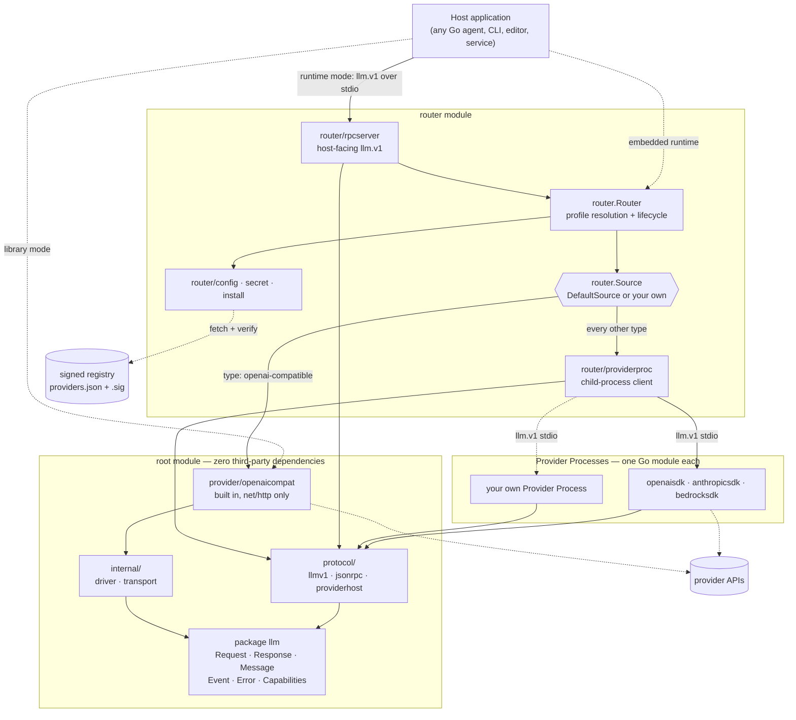
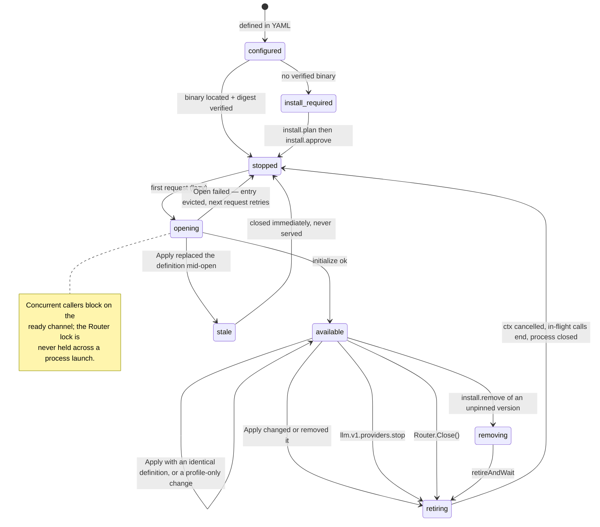

# Architecture

`go-inference-router` is a provider-neutral model contract plus a runtime that
resolves it. A **host application** — any Go agent, CLI, editor plugin, or
server — addresses models by a configured *Model Profile* and never names a
vendor SDK. Nothing in this repository is specific to any one host: the
host-facing surface is either a plain Go interface or a JSON-RPC
protocol over stdio, and both are provider-neutral by construction.

There are two ways to consume the project, and the choice is a deployment
decision, not a fork:

| | **Library mode** | **Runtime mode** |
|---|---|---|
| What the host imports | `llm` + one adapter package | nothing; it launches a process |
| Provider set | fixed at compile time | configured in YAML, changed at runtime |
| Dependencies inherited | only those of the chosen adapter | none |
| Config reload, install, isolation | no | yes |
| Entry point | `openaicompat.New(...)` | `go-inference-router` on stdio |

Both modes speak the same domain types. Library mode is the floor; runtime mode
is library mode plus lifecycle.

---

## 1. Layers

The repository is five layers, each depending only on the ones above it.

```
┌───────────────────────────────────────────────────────────────┐
│ Contract      package llm (repo root)                         │  no third-party deps
│               Request/Response/Message/Event/Error/Capabilities│
├───────────────────────────────────────────────────────────────┤
│ Protocol      protocol/llmv1, protocol/jsonrpc,               │  JSON projection
│               protocol/providerhost                            │  of the contract
├───────────────────────────────────────────────────────────────┤
│ Runtime       router, router/config, router/install,          │  lifecycle, policy,
│               router/secret, router/rpcserver,                │  trust
│               router/providerproc                              │
├───────────────────────────────────────────────────────────────┤
│ Adapters      provider/openaicompat (built in, dep-free)      │  wire formats
│               provider/{openaisdk,anthropicsdk,bedrocksdk}    │  separate modules
├───────────────────────────────────────────────────────────────┤
│ Plumbing      internal/driver, internal/transport             │  shared HTTP/SSE
└───────────────────────────────────────────────────────────────┘
```

The module boundaries are load-bearing, not cosmetic. There are five Go modules:
the root, `router/`, and one per SDK-backed adapter. The root module imports
nothing outside the standard library, so a host that wants only the types and
the `net/http` adapter inherits no vendor SDK, no YAML parser, no keyring, and
no age encryption library (ADR 0001, ADR 0003).

### Component diagram



[`diagrams/components.dot`](diagrams/components.dot) is the detailed version —
it shows every package and edge, and renders with `dot -Tsvg`.

---

## 2. The contract (`package llm`)

The root package is small and deliberately boring. It defines what a model
request and a model response *are*, independent of who serves them.

**Capabilities are optional interfaces, not flags on one god-interface.** The
floor is tiny:

```go
type Provider interface {
    Name() string
    Chat(ctx context.Context, req Request) (*Response, error)
}
```

Everything else — `Streamer`, `Embedder`, `ModelLister`, `MetadataReporter`,
`CapabilityReporter` — is a separate interface a provider *may* also satisfy.
Callers type-assert for what they need. A backend that can only do one-shot chat
is a legal backend, not a pile of `ErrUnsupported` stubs. The Router uses exactly
this: `inferredCapabilities` in `router/router.go` derives a capability set from
which interfaces a provider implements, and a provider that implements
`CapabilityReporter` overrides that inference with something it actually knows.

**Messages carry both a text projection and typed blocks.** `Message.Content` is
the canonical string; `Message.Blocks` is the multimodal representation
(`text`, `image`, `audio`, `tool_call`, `tool_result`, `reasoning`).
`Message.ContentBlocks()` projects the legacy fields into blocks when an adapter
produced a message without them, so an adapter can be simple and a consumer can
still be uniform. Unknown future block types are ignorable by older callers —
that is what makes `llm.v1` additive.

**Optional request fields are pointers when zero is meaningful.**
`ParallelToolCalls *bool` is a pointer because the provider default is `true`:
an explicit `false` must stay distinguishable from "not set", which
`bool` + `omitempty` would erase. Same reasoning for `Temperature`, `TopP`, and
`Seed`. Helpers `llm.Bool/Float/Int64` exist so callers do not litter temporaries.

**Failures are typed, never text.** Every error crossing the seam is an
`*llm.Error` with a stable `Kind`: `auth`, `rate_limit`, `invalid_request`,
`unavailable`, `transport`, `protocol`, `stalled`, `tool_call_parse`,
`canceled`, `unknown`. Hosts branch on `llm.IsKind` and `llm.Retryable`, never on
substrings. Where a provider offers no structured signal, the substring match is
confined to the adapter and converted to a `Kind` at the boundary.

**Streaming and non-streaming return the same thing.** `ChatStream` accumulates
and returns the `*Response` that `Chat` would have returned, so incremental
rendering is a delivery detail rather than a second code path with its own bugs.

**Vendor extras go in `Request.Extra`.** One neutral struct plus an escape hatch,
rather than a union of every vendor's parameters (ADR 0005).

**Observations are metadata only.** `llm.Observation` deliberately excludes
prompts, model output, credentials, headers, environment, URLs, and paths. It
carries operation, phase, timing, IDs, token usage, and an error. `EmitObservation`
recovers from a panicking observer: telemetry must never break inference.

---

## 3. The protocol (`llm.v1`)

`protocol/llmv1` is the JSON projection of the contract, and the only thing in
this repository with a compatibility promise. The Go API is pre-1.0 and
unreleased; `llm.v1` is additive.

The same wire protocol is used for two different hops:

- **host ↔ Router** — `llm.v1.chat`, `llm.v1.profiles.list`,
  `llm.v1.capabilities.get`, `llm.v1.embed`, `llm.v1.models.discover`,
  `llm.v1.providers.status`, `llm.v1.providers.stop`, `llm.v1.config.reload`,
  `llm.v1.install.{plan,approve,available,remove}`, `llm.v1.shutdown`.
- **Router ↔ Provider Process** — `llm.v1.provider.{initialize,chat,models,metadata,embed}`,
  `llm.v1.shutdown`.

Both directions also carry two notifications: `llm.v1.stream.event` (ordered
response deltas) and `llm.v1.observation` (opt-in telemetry).

### Transport

`protocol/jsonrpc` is newline-delimited JSON-RPC 2.0 over any `io.Reader`/
`io.Writer` pair — in practice a child process's stdin/stdout. Three properties
matter:

1. **Calls are concurrent, notifications are ordered.** `Serve` dispatches each
   request in its own goroutine but runs notification handlers inline on the
   reader loop. That is precisely what makes stream events reliable: they are
   notifications, so they cannot overtake each other.
2. **Cancellation is a notification.** A caller whose context ends sends
   `$/cancelRequest` with the pending ID; the peer cancels the handler's context.
   Cancellation therefore propagates host → Router → Provider Process → HTTP
   request without any special-casing.
3. **Closure unblocks everyone.** `closeWith` closes a `done` channel and cancels
   every active handler, so a dead child process cannot leave a caller hanging.

Stdout is reserved for protocol messages; a Provider Process writes logs to
stderr, which the Router forwards to its own `Stderr` writer.

### Sequence

See [`diagrams/request-lifecycle.dot`](diagrams/request-lifecycle.dot) for a
streaming chat call end to end.

---

## 4. The Router

`router.Router` is the runtime. It owns two things and nothing else: **profile
resolution** and **provider lifecycle**.

```go
type Source interface {
    Available(context.Context, string, config.Provider) bool
    Open(context.Context, string, config.Provider) (llm.Provider, error)
}
```

`Source` is the seam between the two. The Router never knows whether a provider
is an in-process adapter or a child process — it gets an `llm.Provider` back
either way, and closes it via `io.Closer` if it implements one. `DefaultSource`
is the production implementation; tests substitute a trivial one. **This is the
extension point for a host that wants its own provider strategy** (an in-house
gateway, a mock, a provider held in memory): implement `Source`, pass it to
`router.New`, and the rest of the runtime is unchanged.

### Provider lifecycle

Providers open **lazily**, on first use, and are cached per Provider Definition
ID. `providerEntry` makes concurrent first-use safe without holding the Router
lock across a process launch:

- the entry is inserted into `r.open` *before* `Source.Open` runs, with a
  `ready` channel;
- concurrent callers find the entry, release the lock, and block on `ready`;
- if `Open` fails, the entry is removed so the next request retries;
- if the entry went **stale** while opening (a config reload replaced it), the
  freshly opened provider is closed immediately rather than handed out.

Each entry owns a `context.Context` cancelled when the provider is retired.
`generationContext` derives a call context from *both* the caller's context and
the entry's, so retiring a provider cancels its in-flight calls, and a caller
cancelling does not affect the provider.



[`diagrams/provider-lifecycle.dot`](diagrams/provider-lifecycle.dot) is the
detailed version, including the invariants this machine guarantees.

### Config reload

`Apply` swaps Provider Definitions and Model Profiles atomically:

- definitions that are byte-identical (`reflect.DeepEqual`) keep running;
- changed or removed definitions are **retired**: their context is cancelled,
  cancelling active calls, then their process is closed;
- profile-only changes reuse the existing provider entirely;
- registry settings are process-bootstrap state and are rejected — they require
  a Router restart.

Config is deep-cloned on the way in and out (`cloneConfig` / `cloneReflect`), so
a caller mutating the map it passed cannot mutate live routing state.

### Concurrency and back-pressure

A Provider Process advertises `MaxConcurrency` during initialization.
`providerproc.Client` holds a buffered `slots` channel of that size and acquires
one per chat/embed call, so the Router queues work above the limit rather than
letting a child process fall over. Acquisition selects on the caller's context
and the process's `done` channel, so a caller waiting behind a queue still
cancels promptly and a crashed process fails its queue immediately.

### Ordering guarantees

Stream events are numbered per request. `providerproc.Client.handleEvent`
rejects any event whose sequence is not exactly `previous + 1` with
`KindProtocol` and cancels the call. Out-of-order delivery is a bug, and it is
detected rather than rendered.

---

## 5. Adapters

An adapter turns one provider's wire format into the contract. There are two
flavors, and the split is a dependency decision (ADR 0003).

**`provider/openaicompat` is built into the root module** and uses only
`net/http`. It drives anything speaking OpenAI chat-completions: OpenAI itself,
llama.cpp, vLLM, Ollama's compatibility endpoint, OpenRouter. Because it costs
no dependencies, it is always available and is the only provider type the Router
can open without an installed binary.

**SDK-backed adapters live in their own Go modules** — `provider/openaisdk`,
`provider/anthropicsdk`, `provider/bedrocksdk` — because vendor SDKs bring
transitive dependency trees the core module refuses to inherit. Each ships a
`cmd/` binary that is a Provider Process.

Shared plumbing lives in `internal/`:

- **`internal/transport.ScanSSE`** — server-sent-event framing: skips comments,
  `event:`/`id:` fields, and blank separators, stops at `[DONE]`. Providers that
  name their events repeat the name inside the JSON payload, so the field is
  redundant; providers that pad with keep-alive comments do not trip callers.
- **`internal/transport.StallGuard`** — a watchdog that bounds *silence between
  reads*, not total duration. That is the right shape for models: minutes of
  steady tokens is fine, a minute of nothing is not. `Stalled()` distinguishes
  "the watchdog cancelled this" from "the caller did", which a context alone
  cannot.
- **`internal/driver.Base`** — provider identity, typed error construction, and
  `KindForStatus`, the one place HTTP status classes map onto `llm.Kind`.

### Writing a new adapter

1. Implement `llm.Provider`, plus whichever optional interfaces you can honestly
   satisfy. Do not stub the ones you cannot.
2. Return `*llm.Error` with a real `Kind` for every failure; use
   `driver.KindForStatus` for HTTP.
3. Accumulate in `ChatStream` and return the same `*Response` `Chat` would.
4. If it needs third-party dependencies, make it its own Go module.
5. To ship it as a Provider Process, add a `cmd/` main — see §6.

---

## 6. Provider Processes

A Provider Process is an executable that adapts one provider to `llm.v1` over
stdio. `protocol/providerhost` reduces writing one to a factory function:

```go
func main() { providerhost.Main("my-provider", version, factory) }

func factory(ctx context.Context, req llmv1.ProviderInitializeRequest, obs llm.Observer,
) (llm.Provider, llm.Capabilities, error) {
    var baseURL string
    if err := providerhost.Config(req.Config, map[string]*string{"base_url": &baseURL}); err != nil {
        return nil, llm.Capabilities{}, err
    }
    return myprovider.New(myprovider.Config{
        Name: req.ProviderID, APIKey: req.Secrets["api_key"], BaseURL: baseURL, Observer: obs,
    }), llm.Capabilities{Streaming: true, Tools: true, MaxConcurrency: 8}, nil
}
```

`providerhost` handles protocol negotiation, lazy initialization, streaming
notification emission, capability-based method rejection, observation
forwarding, and graceful shutdown. **Nothing in this mechanism is first-party.**
A host that wants a private provider builds a binary the same way; the Router
reaches it through `provider.path` in YAML, or through `PATH` lookup when path
lookup is permitted, or through the signed registry if the host runs one.

The child's environment is **allow-listed**, not inherited: `providerEnvironment`
in `router/source.go` passes only `HOME`/`USERPROFILE`, `PATH`, temp dirs,
`SSL_CERT_FILE`/`SSL_CERT_DIR`, and locale. Credentials reach the process only
through the `secrets` map of `llm.v1.provider.initialize` — never through the
environment, never through argv, never through a file the process discovers on
its own.

---

## 7. Configuration

`router/config` loads a versioned YAML file. Two scopes merge: the OS user
config directory, then the workspace `.go-inference-router/models.yaml`.
`--config path` loads that file alone.

Definitions with the same ID are **replaced whole**, never field-merged. This is
a security property, not a convenience: field merging would let a workspace file
inherit the user file's credentials while redirecting `base_url` elsewhere.

`SecretRef.UnmarshalYAML` rejects scalar YAML outright — you cannot write a
plaintext key into config even by accident — and requires exactly one of `env`,
`keychain`, `secret`, or `file`. `router/secret` resolves them:

| Form | Source | Notes |
|---|---|---|
| `env` | environment variable | |
| `keychain` | OS keyring, service `go-inference-router` | |
| `secret` | age-encrypted local store | key from keychain or `INFROUTER_SECRET_STORE_KEY` |
| `file` | regular file | must be owner-only on non-Windows |

The encrypted store opens lazily — a config that never references `secret:`
never touches the keychain. On headless Linux with no keychain service, an
owner-only `secrets.key` is written beside `secrets.age`, but a *new* fallback
key is never created for an *existing* store: silently losing access to
encrypted data is worse than failing loudly.

Decoding uses `KnownFields(true)` and rejects multi-document YAML, so a typo is
an error rather than a silently ignored setting.

---

## 8. Install and trust

Missing Provider Processes are never fetched or executed implicitly. The flow is
two-phase by design, so a host can show a human what is about to be downloaded.

See [`diagrams/install-lifecycle.dot`](diagrams/install-lifecycle.dot).

1. **Plan** — fetch the registry manifest and its `.sig`, verify the Ed25519
   signature against the configured public key, select the newest *stable*
   semver artifact matching provider, protocol, `GOOS`, and `GOARCH`. Return a
   plan with source URL, size, and SHA-256, valid for 10 minutes, single use.
2. **Approve** — consume the plan, download under a `LimitReader` of exactly
   `size+1`, hash while writing to a temp file, reject on any size or digest
   mismatch, `fsync`, then atomically `rename` into the cache and record a
   `.sha256` sidecar.
3. **Locate** — before every launch, re-verify the binary against its recorded
   digest. Installation-time verification does not protect against later
   tampering; launch-time verification does.
4. **Remove** — delete one exact cached version. Versions pinned by config are
   refused; unpinned processes of the same type are stopped first, under a
   removal lock (`Router.RemoveProviderVersion` + `Installer.cacheMu`) so a
   version cannot be deleted mid-install.

Registry URLs must be HTTPS, or HTTP only for loopback. Provider and version
strings are validated as safe identifiers before touching the filesystem, so a
hostile manifest cannot traverse out of the cache. Manifests are size-capped.

Trust is configurable: release builds embed a public key, and private registries
set `registry.url` and `registry.public_key`. When a trusted key is configured,
unmanaged `go-inference-router-provider-*` binaries on `PATH` are **disabled**
unless `registry.allow_path_lookup: true` is explicit. With no key configured at
all, path lookup is permitted — that is the development posture. See ADR 0006.

---

## 9. Observability

Observation is opt-in per session: the host sets `observations: true` in
`llm.v1.initialize`, and `rpcserver.Server` (which is itself an `llm.Observer`)
forwards events as notifications. Provider Processes forward their own
observations up the same path, correlated by request ID, so a host sees SDK
retry attempts from inside a child process attributed to the call that caused
them.

Every observation is a `started`/`finished` pair carrying operation, duration,
profile, provider, model, version, streaming flag, attempt, HTTP status, stream
event count, token usage, and a typed error. It never carries prompts, outputs,
credentials, headers, URLs, or paths — the type has no field for them.

---

## 10. Using it from your own agent

**Library mode.** Import the contract and an adapter; call it directly.

```go
client := openaicompat.New(openaicompat.Config{BaseURL: "http://localhost:8080"})
resp, err := client.ChatStream(ctx, llm.Request{
    Model:    "local-model",
    Messages: []llm.Message{llm.UserMessage("Hello")},
}, func(e llm.Event) error {
    if e.Kind == llm.EventContent { fmt.Print(e.Text) }
    return nil
})
```

**Embedded runtime.** Build a `Router` in-process for profile resolution and
provider lifecycle without launching a Router binary:

```go
cfg, err := config.Load(userPath, workspacePath, "")
r, err := router.New(cfg, router.DefaultSource{Secrets: resolver}, observer)
defer r.Close()
resp, err := r.Chat(ctx, "sonnet", req, nil)
```

**Runtime mode.** Launch `go-inference-router` as a child process and speak
`llm.v1` over its stdio. The host inherits no dependencies at all and gains
config reload, process isolation, and the install lifecycle. Any language that
can write newline-delimited JSON can be the host; Go is not required on the
host side.

**Custom Source.** Implement `router.Source` to supply providers however you
like — an internal gateway, a fake for tests, a provider you already hold in
memory — while keeping profile resolution, cancellation, capability inference,
and observation.

---

## 11. Design rules

These are the rules the code is actually checked against; a change that violates
one needs an ADR, not a workaround.

1. The root module imports nothing outside the standard library.
2. No provider SDK type appears in any signature outside its own adapter module.
3. Capabilities are optional interfaces; a minimal provider is a legal provider.
4. Every error crossing the seam is an `*llm.Error` with a meaningful `Kind`.
5. Unsupported behavior fails with `KindInvalidRequest`; it is never silently
   downgraded to something the caller did not ask for.
6. `ChatStream` returns what `Chat` would have returned.
7. Vendor-specific parameters go in `Extra`, not into new struct fields.
8. Observations carry metadata only, and observer failures never affect
   inference.
9. Secrets are references in config, resolved at open time, delivered only over
   the initialize call.
10. Nothing is downloaded or executed without explicit approval and digest
    verification.

## Further reading

- [`adr/`](adr/) — the decision record, including why the seam exists (0001),
  what the second transport changed (0002), why SDK drivers are separate modules
  (0003), the runtime and process protocol (0004), provider-specific config maps
  (0005), and the Provider Process threat model (0006).
- [`../CONTEXT.md`](../CONTEXT.md) — the ubiquitous language.
- [`../README.md`](../README.md) — configuration reference and provider matrix.
